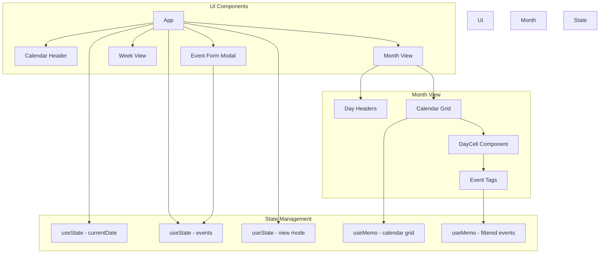
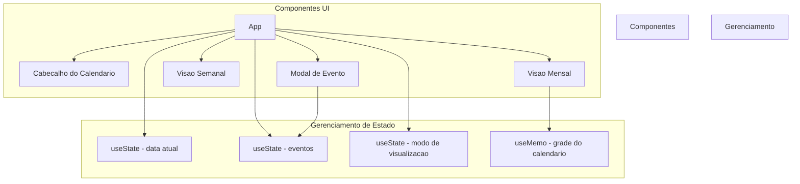

# React Calendar App

Feature-rich calendar application built with React featuring month and week views, event creation and editing, search functionality, recurring events, and a responsive design.

[English](#english) | [Portugues](#portugues)

---

## English

### Overview

A React-based calendar application with full event management capabilities. Supports month and week views, event creation with time ranges, color coding, recurring event scheduling, and search filtering. Built with React hooks and no external calendar library dependencies.

### Architecture



### Features

- Month and week calendar views with navigation
- Event creation with title, description, time range, and color
- Event editing and deletion
- Color-coded event categories
- Recurring events (daily, weekly, monthly)
- Real-time search filtering across events
- Today button for quick navigation
- Responsive grid layout

### Quick Start

```bash
git clone https://github.com/galafis/React-Calendar-App.git
cd React-Calendar-App
npm install
npm start
```

### Project Structure

```
React-Calendar-App/
├── src/
│   └── App.js         # Main calendar application
├── package.json
└── README.md
```

### Tech Stack

| Technology | Purpose |
|------------|---------|
| React | UI framework |
| JavaScript | Application logic |

### License

MIT License - see [LICENSE](LICENSE) for details.

### Author

**Gabriel Demetrios Lafis**
- GitHub: [@galafis](https://github.com/galafis)
- LinkedIn: [Gabriel Demetrios Lafis](https://linkedin.com/in/gabriel-demetrios-lafis)

---

## Portugues

### Visao Geral

Aplicacao de calendario baseada em React com capacidades completas de gerenciamento de eventos. Suporta visualizacoes mensal e semanal, criacao de eventos com intervalos de tempo, codificacao por cores, agendamento de eventos recorrentes e filtragem por busca.

### Arquitetura



### Funcionalidades

- Visualizacoes mensal e semanal do calendario com navegacao
- Criacao de eventos com titulo, descricao, intervalo de tempo e cor
- Edicao e exclusao de eventos
- Categorias de eventos codificadas por cores
- Eventos recorrentes (diario, semanal, mensal)
- Filtragem por busca em tempo real
- Layout de grade responsivo

### Inicio Rapido

```bash
git clone https://github.com/galafis/React-Calendar-App.git
cd React-Calendar-App
npm install
npm start
```

### Licenca

Licenca MIT - veja [LICENSE](LICENSE) para detalhes.

### Autor

**Gabriel Demetrios Lafis**
- GitHub: [@galafis](https://github.com/galafis)
- LinkedIn: [Gabriel Demetrios Lafis](https://linkedin.com/in/gabriel-demetrios-lafis)
